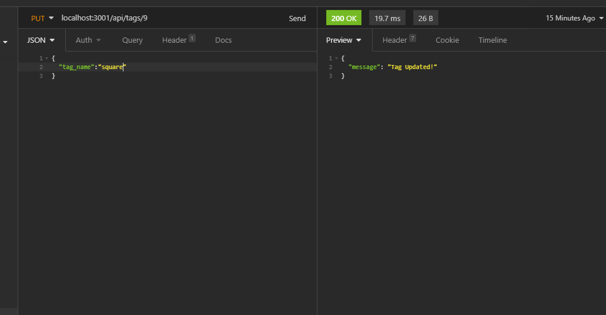

# E-Commerce-Back-End

## Description

A working server and database that accepts json inputs and returns relevant data as well as allows the user to update, create, or delete items in different tables within the database.

## Table of Contents

- [Installation](#installation)
- [Usage](#usage)
- [License](#license)

## Installation

- Must set up a .env file containing variables to represent database name, password, and user.
- Run npm install in the terminal.
- In the cmd terminal log into mysql and run the commands in /db/schema.sql to create database tables.
- In the terminal enter node ./seeds/index.js to put data in the tables.
- Run npm start to get the server running and connected.

## Usage

Use insomnia to connect to api routes (and send json in body when appropriate) to view, create, update, and delete rows in all three database tables.

[A video walkthrough is available here!](https://www.youtube.com/watch?v=xGA_R6SswfA)
[With a bit I forgot here!](https://www.youtube.com/watch?v=rN7HZfVZVnQ)

    

## License

Copyright (c) 2021 Sean Kelly

Permission is hereby granted, free of charge, to any person obtaining a copy
of this software and associated documentation files (the "Software"), to deal
in the Software without restriction, including without limitation the rights
to use, copy, modify, merge, publish, distribute, sublicense, and/or sell
copies of the Software, and to permit persons to whom the Software is
furnished to do so, subject to the following conditions:

The above copyright notice and this permission notice shall be included in all
copies or substantial portions of the Software.

THE SOFTWARE IS PROVIDED "AS IS", WITHOUT WARRANTY OF ANY KIND, EXPRESS OR
IMPLIED, INCLUDING BUT NOT LIMITED TO THE WARRANTIES OF MERCHANTABILITY,
FITNESS FOR A PARTICULAR PURPOSE AND NONINFRINGEMENT. IN NO EVENT SHALL THE
AUTHORS OR COPYRIGHT HOLDERS BE LIABLE FOR ANY CLAIM, DAMAGES OR OTHER
LIABILITY, WHETHER IN AN ACTION OF CONTRACT, TORT OR OTHERWISE, ARISING FROM,
OUT OF OR IN CONNECTION WITH THE SOFTWARE OR THE USE OR OTHER DEALINGS IN THE
SOFTWARE.

